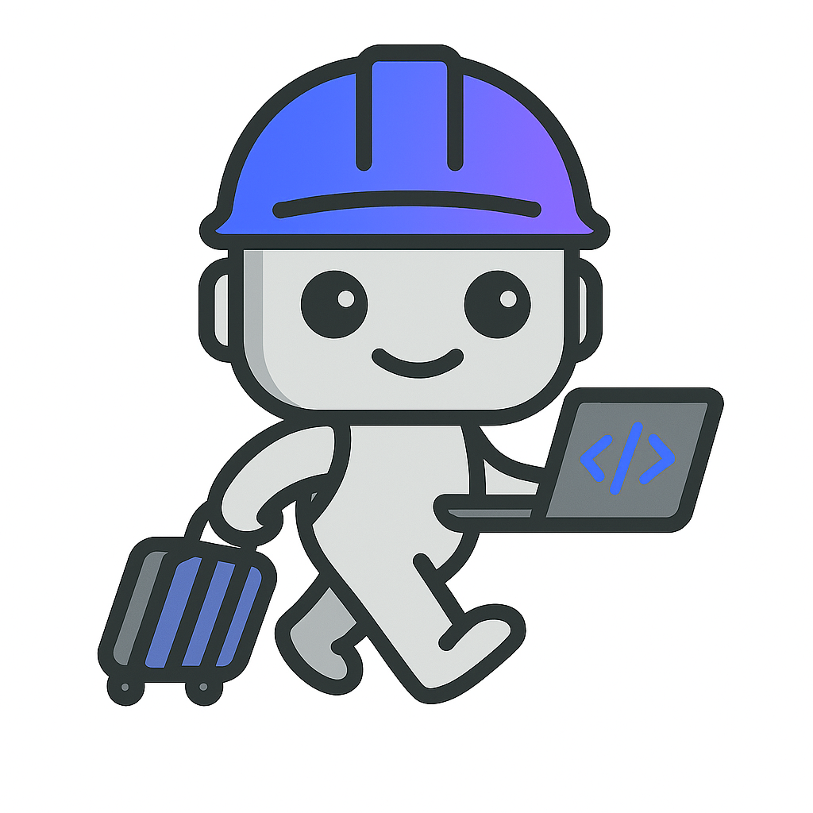
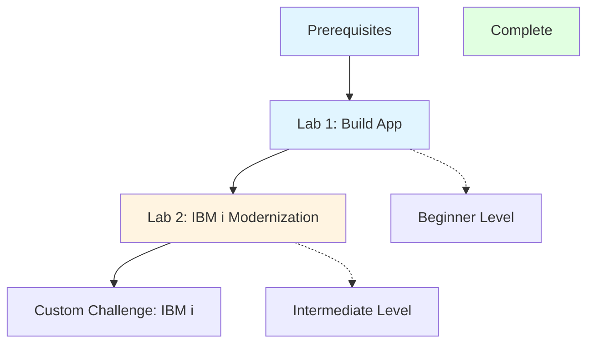

# Bob and IBM i: Hands-On Labs

Welcome to the Bobathon hands-on labs! This comprehensive training series will teach you how to leverage IBM Bob's AI-powered development capabilities through practical, real-world exercises.

## 🎯 Overview

These labs are designed to give you hands-on experience with Bob's core features through progressive exercises:

1. **Lab 1: Building Applications** - Create a full-stack todo application (45 minutes)
2. **Lab 2: IBM i Modernization** - Six hands-on labs for IBM i modernization (95 minutes)
3. **Custom Challenge:** - IBM i specifc; will be discussed in or before a Bobathon (~2 hours)

**Total Learning Time**: ~4-5 hours

## 🚀 What You'll Learn

### Bob's Core Features
- **Multiple Modes**: Plan, Code, and Ask modes for different tasks
- **Auto-approvals**: Rapid development with automated confirmations
- **Literate Coding**: Self-documenting code with inline explanations
- **MCP Servers**: Integration with GitHub and custom services
- **BobShell**: Command-line interface and automation
- **Code Analysis**: Understanding and improving existing codebases
- **Security Awareness**: Identifying and fixing vulnerabilities
- **Code Translation**: Converting code between languages
- **Custom Modes**: Creating specialized Bob modes
- **MCP Development**: Building custom MCP servers

### Technical Skills
- Full-stack web development (Python Flask + JavaScript)
- REST API design and implementation
- Security best practices (SQL injection, XSS, secrets management)
- Cross-language development patterns
- MCP server development
- Custom mode creation

## 📋 Prerequisites

Before starting these labs, ensure you have:

### Required Software
- **Python 3.8+** - [Download](https://www.python.org/downloads/)
- **Node.js 14+** - [Download](https://nodejs.org/)
- **Git 2.x+** - [Download](https://git-scm.com/)
- **Bob** - [Download](https://bob.ibm.com/download/)
- **Text Editor/IDE** - VS Code recommended

### Required Knowledge
- Basic Python syntax and concepts
- Basic JavaScript syntax and concepts
- HTML/CSS fundamentals
- REST API concepts
- Git basics
- Command line usage

### Account Setup
- GitHub account (for Lab 1)
- Bob account configured
- GitHub MCP server connected (optional but recommended)

For detailed setup instructions, see [prerequisites.md](prerequisites.md).

## 📚 Lab Structure

### 🟢 Beginner Track (Labs 1-2)

#### Lab 1: Building a Todo Application (45 minutes)
**Focus**: Creation and Development

Learn to use Bob's different modes to build a complete full-stack application from scratch.

**What You'll Build**:
- Python Flask REST API backend
- JavaScript frontend with modern UI
- SQLite database integration
- GitHub repository with version control

**Bob Features**:
- ✅ Plan Mode for planning
- ✅ Code Mode for implementation
- ✅ Auto-approvals for rapid development
- ✅ Literate coding for documentation
- ✅ GitHub MCP for version control

**[Start Lab 1 →](lab1/README.md)**

---

#### Lab 2: IBM i Modernization Labs (95 minutes)
**Focus**: IBM i Application Modernization

Six progressive labs teaching IBM i modernization using Bob AI assistant. Work with the SAMCO application - a legacy order management system with green screen interface and 20+ year old RPG code.

**What You'll Learn**:
- **Lab 0** (15 min): Discover the Application - Understand legacy code structure and business rules
- **Lab 1** (15 min): RPG Modernization - Convert legacy RPG to modern free format
- **Lab 2** (15 min): UI Modernization - Build modern web UI with React and Carbon Design
- **Lab 3** (15 min): RLA to SQL - Transform record-level access to modern SQL with JOINs
- **Lab 4** (15 min): IBM i MCP - Configure Bob for IBM i development with MCP tools
- **Lab 5** (20 min): PTF Management - Automate IBM i system management with Ansible

**Bob Features**:
- ✅ Ask Mode for code understanding
- ✅ Plan Mode for modernization planning
- ✅ Code Mode for implementation
- ✅ Multi-file code analysis
- ✅ IBM i-specific MCP integration
- ✅ Custom modes for specialized workflows

**[Start Lab 2 →](lab2/README.md)**

---

## 🗺️ Learning Path



### Recommended Progression
1. **Complete prerequisites** - Ensure all software is installed
2. **Lab 1 (Beginner)** - Build foundational understanding
3. **Lab 2 (Intermediate)** - Learn IBM i modernization (6 sublabs)
4. **Custom Challenge (Advanced)** - Master advanced techniques
5. **Review and practice** - Apply to your own projects

### Time Commitment
- **Lab 1**: 45 minutes
- **Lab 2**: 95 minutes (6 sublabs: 15+15+15+15+15+20)
- **Custom Challenge**: ~2 hours
- **Total**: ~6 hours (including breaks)

## 📖 Additional Resources

### Documentation
- [Prerequisites & Setup](prerequisites.md) - Detailed setup instructions

### Support
- Bob Documentation - Official docs
- Community Forum - Ask questions
- GitHub Issues - Report problems

## ✅ Success Criteria

You'll know you've successfully completed the bootcamp when you can:

### After Lab 1 (Beginner)
- [ ] Switch confidently between Bob's different modes
- [ ] Use auto-approvals effectively for rapid development
- [ ] Apply literate coding principles to your code
- [ ] Integrate GitHub MCP for version control
- [ ] Build full-stack applications with Bob

### After Lab 2 (Intermediate)
- [ ] Understand and modernize legacy IBM i code
- [ ] Convert RPG fixed format to free format
- [ ] Build modern web UIs for IBM i applications
- [ ] Convert RLA operations to SQL
- [ ] Configure Bob with IBM i MCP tools
- [ ] Automate IBM i system management with Ansible

## 🎓 What's Next?

After completing these labs, you can:

1. **Apply to Real Projects**: Use Bob on your own development work
2. **Explore Advanced Features**: Dive deeper into Bob's capabilities
3. **Join the Community**: Share your experience and help others
4. **Build Your Portfolio**: Showcase your Bob-powered projects
5. **Continue Learning**: Explore additional MCP servers and integrations
6. **Create Custom Tools**: Build your own MCP servers and modes
7. **Contribute**: Help improve Bob and its ecosystem

## 🤝 Contributing

Found an issue or have a suggestion? We welcome contributions!

- Report bugs via GitHub Issues
- Submit improvements via Pull Requests
- Share feedback in the Community Forum
- Help other learners in discussions

## 📝 License

This educational content is provided for learning purposes. Please refer to the LICENSE file for details.

## 🙏 Acknowledgments

Created with ❤️ using Bob to demonstrate Bob's capabilities.

Special thanks to the Bob development team and the community for their support.

---

## Quick Start

Ready to begin? Here's how to get started:

1. **Verify Prerequisites**
   ```bash
   python --version    # Should be 3.8+
   node --version      # Should be 14+
   git --version       # Should be 2.x+
   ```

2. **Clone or Download**
   ```bash
   git clone <repository-url>
   cd bobathon-ibm-i
   ```

3. **Start Lab 1**
   ```bash
   cd lab1
   # Follow instructions in lab1/README.md
   ```

4. **Get Help**
   - Check the troubleshooting guide
   - Use Bob's Ask mode for questions
   - Review the documentation

---

## Lab Completion Tracking

Track your progress through the bootcamp:

- [ ] Lab 1: Building Applications ✅
- [ ] Lab 2: IBM i Modernization ✅
  - [ ] Lab 2.0: Discover SAMCO Application
  - [ ] Lab 2.1: RPG Fixed-to-Free Conversion
  - [ ] Lab 2.2: Build Simple Article List (React)
  - [ ] Lab 2.3: Convert RLA to SQL
  - [ ] Lab 2.4: IBM i MCP Configuration
  - [ ] Lab 2.5: Ansible PTF Management
- [ ] Custom Challenge: IBM i

**Legend**: ✅ Complete | 🚧 In Progress | ⬜ Not Started

**All labs are now complete and ready for use!**

---

**Ready to start your Bob journey? [Begin with Lab 1 →](lab1/README.md)**

---

*Last Updated: May 2026*
*Version: 2.1 - Streamlined Series*
