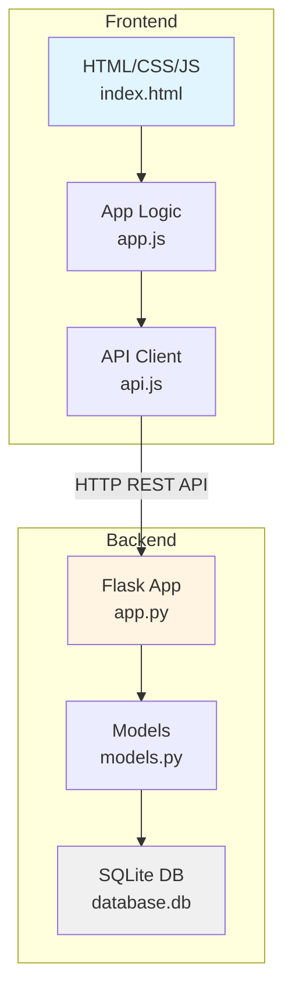
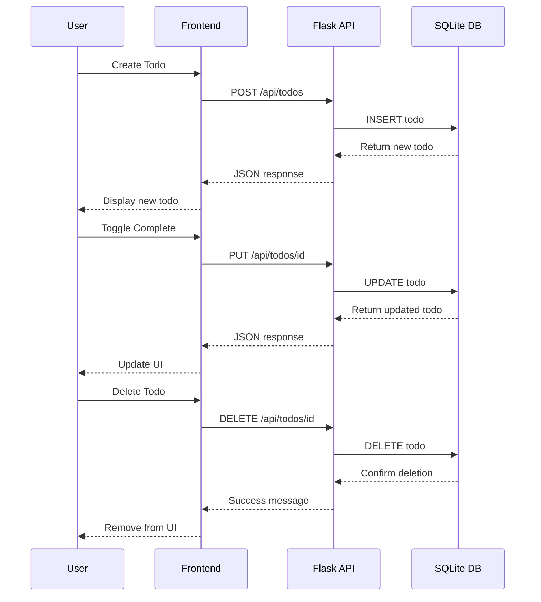

# Todo Application - Project Plan

## Overview
A basic todo application with Flask backend and JavaScript frontend, using SQLite for data persistence. Single-user CRUD operations for managing todo items.

---

## 1. Project Directory Structure

```
todo-app/
├── backend/
│   ├── app.py                 # Main Flask application
│   ├── models.py              # Database models
│   ├── config.py              # Configuration settings
│   ├── requirements.txt       # Python dependencies
│   ├── database.db            # SQLite database (auto-generated)
│   └── tests/
│       └── test_api.py        # API tests
│
├── frontend/
│   ├── index.html             # Main HTML page
│   ├── css/
│   │   └── style.css          # Styling
│   ├── js/
│   │   ├── app.js             # Main application logic
│   │   └── api.js             # API communication layer
│   └── assets/
│       └── favicon.ico        # App icon
│
├── .gitignore                 # Git ignore file
└── README.md                  # Project documentation
```

---

## 2. API Endpoints

### Base URL: `http://localhost:5000/api`

| Method | Endpoint | Description | Request Body | Response |
|--------|----------|-------------|--------------|----------|
| GET | `/todos` | Get all todos | None | `[{id, title, description, completed, created_at}]` |
| GET | `/todos/<id>` | Get single todo | None | `{id, title, description, completed, created_at}` |
| POST | `/todos` | Create new todo | `{title, description?}` | `{id, title, description, completed, created_at}` |
| PUT | `/todos/<id>` | Update todo | `{title?, description?, completed?}` | `{id, title, description, completed, created_at}` |
| DELETE | `/todos/<id>` | Delete todo | None | `{message: "Todo deleted"}` |

### API Response Format

**Success Response:**
```json
{
  "success": true,
  "data": { ... }
}
```

**Error Response:**
```json
{
  "success": false,
  "error": "Error message"
}
```

### Example API Calls

**Create Todo:**
```bash
POST /api/todos
Content-Type: application/json

{
  "title": "Buy groceries",
  "description": "Milk, eggs, bread"
}
```

**Update Todo:**
```bash
PUT /api/todos/1
Content-Type: application/json

{
  "completed": true
}
```

---

## 3. Database Schema

### SQLite Database: `database.db`

#### Table: `todos`

| Column | Type | Constraints | Description |
|--------|------|-------------|-------------|
| id | INTEGER | PRIMARY KEY, AUTOINCREMENT | Unique identifier |
| title | TEXT | NOT NULL | Todo title (required) |
| description | TEXT | NULL | Optional description |
| completed | BOOLEAN | DEFAULT FALSE | Completion status |
| created_at | TIMESTAMP | DEFAULT CURRENT_TIMESTAMP | Creation timestamp |
| updated_at | TIMESTAMP | DEFAULT CURRENT_TIMESTAMP | Last update timestamp |

#### SQL Schema:
```sql
CREATE TABLE todos (
    id INTEGER PRIMARY KEY AUTOINCREMENT,
    title TEXT NOT NULL,
    description TEXT,
    completed BOOLEAN DEFAULT 0,
    created_at TIMESTAMP DEFAULT CURRENT_TIMESTAMP,
    updated_at TIMESTAMP DEFAULT CURRENT_TIMESTAMP
);

-- Index for faster queries on completed status
CREATE INDEX idx_completed ON todos(completed);
```

---

## 4. Technology Stack

### Backend
- **Framework:** Flask 3.0+
- **Database ORM:** SQLAlchemy 2.0+
- **CORS:** Flask-CORS (for cross-origin requests)
- **Database:** SQLite 3
- **Python Version:** 3.9+

### Frontend
- **HTML5** - Structure
- **CSS3** - Styling (with Flexbox/Grid)
- **Vanilla JavaScript (ES6+)** - Logic and interactivity
- **Fetch API** - HTTP requests to backend

### Development Tools
- **Version Control:** Git
- **Code Editor:** VS Code
- **Testing:** pytest (backend), manual testing (frontend)
- **Package Manager:** pip (Python)

### Dependencies

#### Backend (`requirements.txt`):
```
Flask==3.0.0
Flask-CORS==4.0.0
SQLAlchemy==2.0.23
python-dotenv==1.0.0
```

#### Frontend:
No external dependencies - pure vanilla JavaScript

---

## 5. Implementation Plan

### Phase 1: Backend Setup
1. Create project directory structure
2. Set up Python virtual environment
3. Install Flask and dependencies
4. Create Flask application with basic configuration
5. Set up SQLAlchemy models for todos
6. Implement database initialization
7. Create API endpoints (CRUD operations)
8. Add CORS support for frontend communication
9. Test API endpoints using curl or Postman

### Phase 2: Frontend Development
1. Create HTML structure with semantic markup
2. Design CSS styling (responsive, modern UI)
3. Implement JavaScript API communication layer
4. Build todo list display functionality
5. Add create todo form
6. Implement update/toggle completion
7. Add delete functionality
8. Implement error handling and user feedback

### Phase 3: Integration & Testing
1. Connect frontend to backend API
2. Test all CRUD operations end-to-end
3. Handle edge cases and errors
4. Add loading states and user feedback
5. Test responsive design on different screen sizes

### Phase 4: Polish & Documentation
1. Add input validation (frontend and backend)
2. Improve UI/UX with animations
3. Write comprehensive README
4. Add code comments
5. Create .gitignore file
6. Optional: Add basic unit tests

---

## 6. Key Features

### Core Functionality
- ✅ Create new todos with title and optional description
- ✅ View all todos in a list
- ✅ Mark todos as complete/incomplete
- ✅ Edit existing todos
- ✅ Delete todos
- ✅ Persistent storage with SQLite

### User Interface
- Clean, modern design
- Responsive layout (mobile-friendly)
- Visual feedback for actions
- Loading states during API calls
- Error messages for failed operations
- Empty state when no todos exist

---

## 7. Setup Instructions (for implementation)

### Backend Setup:
```bash
# Navigate to backend directory
cd backend

# Create virtual environment
python -m venv venv

# Activate virtual environment
# On macOS/Linux:
source venv/bin/activate
# On Windows:
venv\Scripts\activate

# Install dependencies
pip install -r requirements.txt

# Run Flask application
python app.py
```

### Frontend Setup:
```bash
# Simply open index.html in a browser
# Or use a local server:
python -m http.server 8000
# Then visit: http://localhost:8000
```

---

## 8. Architecture Diagram



---

## 9. API Flow Diagram



---

## 10. Security Considerations

For this basic single-user application:
- Input validation on both frontend and backend
- SQL injection prevention (using SQLAlchemy ORM)
- CORS configuration (restrict to specific origins in production)
- Error messages that don't expose sensitive information

**Note:** For production use with multiple users, add:
- User authentication (JWT tokens)
- Authorization checks
- Rate limiting
- HTTPS encryption
- Environment variables for sensitive config

---

## 11. Future Enhancements (Optional)

- User authentication and multi-user support
- Categories/tags for todos
- Due dates and reminders
- Priority levels
- Search and filter functionality
- Drag-and-drop reordering
- Dark mode toggle
- Export todos to JSON/CSV
- Progressive Web App (PWA) features
- Real-time updates with WebSockets

---

## 12. Estimated Timeline

- **Backend Development:** 2-3 hours
- **Frontend Development:** 2-3 hours
- **Integration & Testing:** 1-2 hours
- **Documentation & Polish:** 1 hour

**Total:** 6-9 hours for a complete, polished application

---

## Next Steps

Once you approve this plan, we can switch to **Code mode** to implement:
1. Backend Flask application with all API endpoints
2. Frontend HTML/CSS/JavaScript interface
3. Database models and initialization
4. Complete integration and testing

Would you like to proceed with implementation or make any changes to this plan?