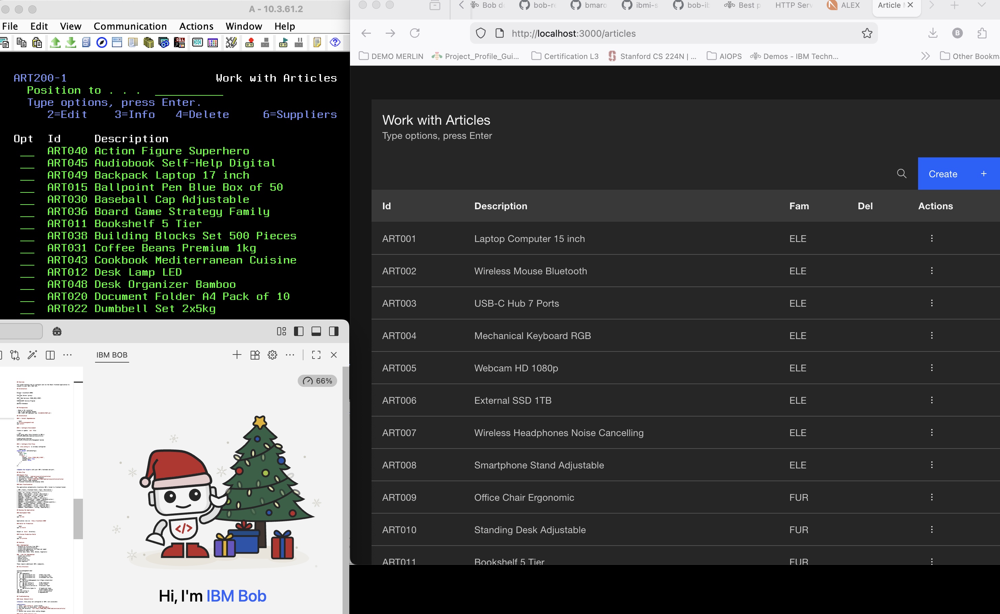

# IBM i Modernization Labs 101 - Getting Started with Bob

## Overview

Six hands-on labs to learn IBM i modernization using IBM Bob AI assistant. Each lab focuses on one practical use case you can complete quickly.

The application SAMCO is a simple order management system. It has a green screen interface and RPG code that is over 20 years old. It is a good example of a system that could benefit from modernization on the IBM i platform! 

For essential concepts and best practices when using IBM Bob for IBM i modernization, see the [Bob Concepts & Best Practices](./bob-concepts-and-best-practices.md) guide.

---



---

## 🎯 The Labs
| Lab_Number | Description | Time | Lab Details      |
|------------|-------------|------|------------------|
| **Lab 0** | Discover the Application - Use Bob to understand legacy code structure, business rules, and program flow | 15 min | [Lab 0](#lab-0-discover-the-samco-application) |
| **Lab 1** | RPG modernization & refactoring - Convert legacy RPG code to modern RPG | 15 min | [Lab 1](#lab-1-rpg-fixed-to-free-conversion) |
| **Lab 2** | Build a Simple Article List - Create a modern web UI using React and Carbon Design System | 15 min | [Lab 2](#lab-2-build-a-simple-article-list) |
| **Lab 3** | Convert RLA to SQL - Transform record-level access operations to modern SQL with JOINs | 15 min | [Lab 3](#lab-3-convert-rla-to-sql) |
| **Lab 4** | IBM Bob with IBM i MCP - Configure Bob for IBM i development with MCP tools and custom modes | 15 min | [Lab 4](#lab-4-ibm-bob-with-ibm-i-mcp) |
| **Lab 5** | PTF Management Assistant - Automate IBM i system management with Bob & ansible | 20 min | [Lab 5](#lab-5-ansible-assistant-for-ptf-management) |


### Lab 0: Discover the SAMCO Application
**Time**: 15 minutes | **File**: [lab0-rpg-project-introduction.md](lab0-rpg-project-introduction.md)

**What You'll Do:**
- Ask Bob to explain the SAMCO application purpose and structure
- Understand business rules (VAT, orders, soft deletes)
- Learn the panel-step pattern used in interactive programs
- Trace the complete order creation flow

**Use Case**: Use Bob as a discovery tool to understand legacy code before modernizing

---

### Lab 1: RPG Fixed-to-Free Conversion
**Time**: 15 minutes | **File**: [lab1-rpg-documentation-fixed-to-free.md](lab1-rpg-documentation-fixed-to-free.md)

**What You'll Do:**
- Ask Bob to explain legacy RPG code
- Convert one subroutine from Fixed to Free format
- Replace magic numbers with named constants

**Use Case**: Convert the subfile load logic (s01lod) to modern RPG

---

### Lab 2: Build a Simple Article List
**Time**: 15 minutes | **File**: [lab2-ui-modernization-react-carbon.md](lab2-ui-modernization-react-carbon.md)

**What You'll Do:**
- Ask Bob to show you the green screen layout
- Create sample data with Bob's help
- Build a modern web table with search

**Use Case**: Display articles in a web browser using Carbon Design System

---

### Lab 3: Convert RLA to SQL
**Time**: 15 minutes | **File**: [lab3-dds-to-sql-rla-refactoring.md](lab3-dds-to-sql-rla-refactoring.md)

**What You'll Do:**
- Ask Bob to explain a CHAIN operation
- Convert it to SQL SELECT
- Use JOIN to get related data in one query

**Use Case**: Convert article lookup from RLA to SQL with JOIN

---

### Lab 4: IBM Bob with IBM i MCP
**Time**: 15 minutes | **File**: [lab4-ibmi-mcp-mode.md](lab4-ibmi-mcp-mode.md)

**What You'll Do:**
- How to configure Bob for IBM i development with MCP and modes
- How to use IBM i-specific AI agent modes
- How to query IBM i systems using natural language
- How to leverage pre-built IBM i tools

**Use Case**: Customize Bob for IBM i development and leverage IBM i-specific tools

---

### Lab 5: Ansible Assistant for PTF Management
**Time**: 20 minutes | **File**: [lab5-ansible-ptf-management.md](lab5-ansible-ptf-management.md)

**What You'll Do:**
- Configure Bob with Ansible for IBM i expertise
- Generate automated PTF currency check playbooks
- Create compliance reports for system administrators
- Explore AIOps scenarios for IBM i environments

**Use Case**: Address skills shortage in IBM i DevOps through AI-assisted system automation and PTF management


## 💡 How to Use These Labs

### Working with Bob

Each lab has **specific prompts** to ask Bob. For example:

```
@SAMCO/QRPGLESRC/ART200-Work_with_article.PGM.SQLRPGLE

Explain what the s01lod subroutine does (lines 102-118).
```

**Tips:**
- ✅ Copy the prompt exactly as shown
- ✅ Include the @ file reference when specified
- ✅ Read Bob's response carefully
- ✅ Ask follow-up questions if unclear

---

## 📚 What You'll Learn

### Lab 1 Skills
- Understanding legacy RPG code
- Fixed-to-Free format conversion
- Using procedures instead of subroutines
- Named constants for maintainability

### Lab 2 Skills
- Visualizing green screen layouts
- Creating sample data
- Building modern web UIs
- Using Carbon Design System components

### Lab 3 Skills
- Understanding RLA operations
- Converting to SQL
- Using JOINs for related data
- SQL performance benefits

### Lab 4 Skills
- Getting started with MCP and IBM i
- Understand IBM i modes
- Using tools on IBM i
- Using Bob Shell and shell for automating IBM i tasks

### Lab 5 Skills
- Configuring Bob custom modes for specialized domains
- Ansible automation for IBM i systems
- PTF management and compliance reporting
- AIOps and DevOps automation strategies
- Addressing skills shortage with AI assistance

---

## 🎓 Learning Path

**Recommended Order:**

```
Start Here
    ↓
Lab 0 (Discover SAMCO)
    ↓
Lab 1 (RPG Basics)
    ↓
Lab 3 (SQL Conversion)
    ↓
Lab 2 (Web UI)
    ↓
Lab 4 (IBM i MCP)
    ↓
Lab 5 (Ansible Automation)
    ↓
Done! 🎉
```

**Or start with Lab 2** if you want to see the web UI first!

---

## 🔧 Troubleshooting

### Bob Not Responding?
- Check your connection
- Try rephrasing the question
- Make sure file references are correct

### Lab 2 - npm install fails?
```bash
cd article-management-web
rm -rf node_modules package-lock.json
npm install
```

### Lab 3 - SQL syntax errors?
- Check the ART400.SQLRPGLE file for working examples
- Ask Bob to explain the error

---

## 🎯 After Completing the Labs

### What's Next?

**Expand Your Skills:**
- Convert more subroutines in ART200
- Add edit/delete to the web UI
- Convert more RLA operations to SQL

**Apply to Your Code:**
- Identify similar patterns in your applications
- Start with small, low-risk changes
- Use Bob to help with conversions

**Learn More:**
- Explore the full ART400 service program
- Study the complete React application
- Review the modernization-plan/ directory

---

## 💬 Getting Help

**Ask Bob:**
- "Explain this code to me"
- "How do I convert this to Free format?"
- "What's the SQL equivalent of this RLA operation?"
- "Show me an example of..."

**Common Questions:**

**Q: Do I need an IBM i system?**  
A: Not for Lab 2. Labs 1 and 3 work with code files only.

**Q: Can I skip labs?**  
A: Yes! Each lab is independent.

**Q: How long does each lab really take?**  
A: 15 minutes if you follow the prompts. Take longer if you want to explore!

---

## 📝 Lab Format

Each lab follows this simple structure:

1. **Overview** - What you'll build
2. **Prerequisites** - What you need
3. **Use Case** - The practical example
4. **Steps** - 4-5 simple steps with Bob prompts
5. **Success Criteria** - How to know you're done
6. **Key Takeaways** - What you learned
7. **Next Steps** - Where to go from here

---

## 🌟 Tips for Success

1. **Follow the Prompts**: They're designed to work with Bob
2. **Read Bob's Responses**: Don't just copy code, understand it
3. **One Step at a Time**: Complete each step before moving on
4. **Ask Questions**: Bob is there to help - use it!

---

## 📊 Time Breakdown

| Lab | Setup | Steps | Review | Total |
|-----|-------|-------|--------|-------|
| Lab 0 | 1 min | 11 min | 3 min | 15 min |
| Lab 1 | 2 min | 10 min | 3 min | 15 min |
| Lab 2 | 2 min | 10 min | 3 min | 15 min |
| Lab 3 | 2 min | 10 min | 3 min | 15 min |
| Lab 4 | 2 min | 10 min | 3 min | 15 min |
| Lab 5 | 3 min | 14 min | 3 min | 20 min |
| **All 6** | | | | **95 min** |

---

## 🎉 Congratulations!

After completing these labs, you'll know how to:
- ✅ Use Bob to understand and modernize RPG code
- ✅ Build modern web interfaces for IBM i applications
- ✅ Convert RLA operations to SQL
- ✅ Apply these patterns to your own code

**Keep learning and modernizing!** 🚀

---

## 🏗️ Building and Testing SAMCO on IBM i

Want to build and test the actual green screen SAMCO application on your IBM i system? Follow these steps.

Draft documentation: Build with vscode not documented yet. Dependency management is done via Tobi is not 100% documented yet, but the application can compile and will be functional: some programs may not work due to missing dependencies.

### Prerequisites

- IBM i system (7.3 or higher recommended)
- IBM Bob with [Code for IBM i](https://marketplace.visualstudio.com/items?itemName=HalcyonTechLtd.code-for-ibmi) extension + other related extensions.
- SSH access to IBM i
- User profile with appropriate authorities 
- [Tobi](https://ibm.github.io/ibmi-tobi/#/) build tool installed: `/QOpenSys/pkgs/bin/makei`

### Building the Application

**1. Install Tobi on IBM i** (if not already installed):
```bash
# SSH to your IBM i system
yum install ibmi-tobi
```

**2. Optional - Configure VS Code Connection:**
- Install "Code for IBM i" extension in IBM Bob / vscode
- Press `F1` → "IBM i: New Connection"
- Enter your IBM i hostname, username, and password
- Connect to your system

**3. Create Target Library:**

```bash
# Create target library 
CRTLIB LIB(SAMCO) TEXT('SAMCO Application')
```
or
```bash
# In IBM i PASE (shell) 
system "CRTLIB LIB(SAMCO) TEXT('SAMCO Application')"
```
**4. Clone and Open Project:**
```bash
# In Bob terminal / shell on IBM i
cd /home/YOURUSER
git clone https://github.com/bmarolleau/IBM-i-Application-Modernization-with-Bob
cd IBM-i-Application-Modernization-with-Bob/SAMCO
```

**5. Build the application**
```bash
# SSH to IBM i
cd /home/YOURUSER/IBM-i-Application-Modernization-with-Bob/SAMCO
export lib1=SAMCO
system "addlible SAMCO"
/QOpenSys/pkgs/bin/makei build
```

The build process compiles all source types: RPG, COBOL, CL, DDS, SQL, etc.

**5. Populate Db2 tables**

Use [SAMCO/POPULATE_SAMCO_TABLES.sql](./SAMCO/POPULATE_SAMCO_TABLES.sql) to populate the tables with sample data. You can run this from the IBM i Navigator or from the IBM i Access Client Solutions.

### Testing the Green Screen Application

**1. Start a 5250 Session:**
- Use your preferred 5250 emulator (ACS, TN5250, etc.)
- Sign in to your IBM i system

**2. Set Library List:**
```
ADDLIBLE LIB(SAMCO)
```

**3. Run Key Programs:**

| Program | Description | Command |
|---------|-------------|---------|
| `SAMMNU` | SAMCO Main Menu | `GO SAMCO/SAMMNU` |
| `ART200` | Work with Articles | `CALL SAMCO/ART200` |
| `ORD200` | Work with Orders | `CALL SAMCO/ORD200` |
| `CUS200` | Work with Customers | `CALL SAMCO/CUS200` |

**4. Navigate the Interface:**
- Use function keys (F3=Exit, F5=Refresh, F6=Add, etc.)
- Test CRUD operations (Create, Read, Update, Delete)
- Explore the subfile displays

### Quick Reference

```bash
# Build entire project
/QOpenSys/pkgs/bin/makei build

# Build specific component
/QOpenSys/pkgs/bin/makei c -f QRPGLESRC/ART200.PGM.SQLRPGLE

# Clean build artifacts
/QOpenSys/pkgs/bin/makei clean
```

**Next Steps:** Once the green screen app is running, try the modernization labs to see how Bob can help transform it into a modern web application!

---

## 📚 Additional Resources

- **IBM Bob Documentation**: Ask Bob "How do I use you effectively?"
- **Carbon Design System**: https://carbondesignsystem.com/
- **RPG Cafe**: https://www.rpgpgm.com/

---

*These labs are designed for beginners. No prior modernization experience required!*