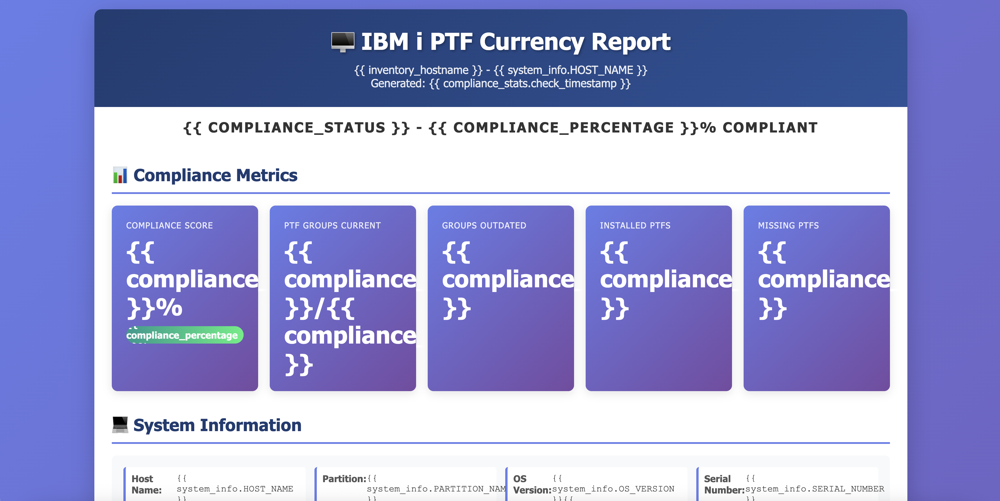
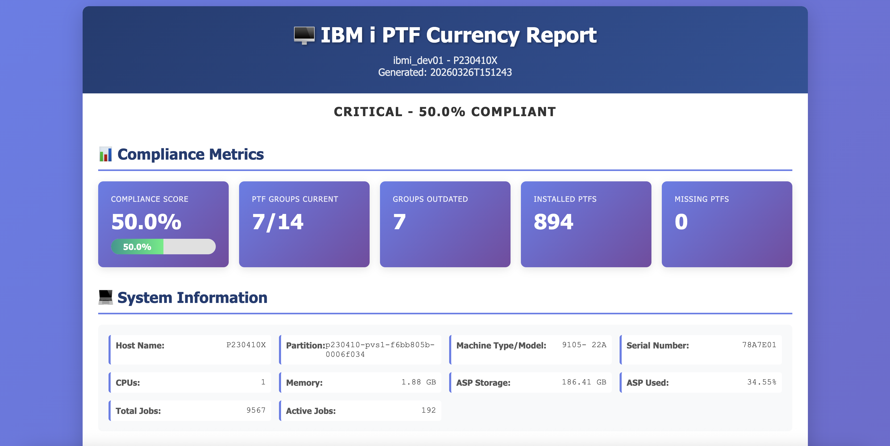

# Lab 5: Building a PTF Management Assistant on IBM i with IBM Bob & Ansible

**Duration:** 20 minutes  
**Difficulty:** Intermediate   
**Version:** 2 - April 1 , 2026


## Introduction

This lab guides you through creating an automated assistant to manage Program Temporary Fixes (PTFs) on IBM i systems using Ansible with Bob AI assistant integration. You'll learn to leverage Bob's AI capabilities to streamline PTF currency checks, automate compliance reporting, and manage system updates efficiently.

**Objectives:**
- Configure Bob with specialized Ansible for IBM i knowledge
- Create playbooks to query and report PTF status
- Automate PTF currency compliance checking
- Generate formatted reports for system administrators
- Explore advanced automation scenarios for IBM i environments

## Prerequisites

### IBM i System Requirements
- IBM i 7.3 or higher
- SSH daemon running (`STRTCPSVR SERVER(*SSHD)`)
- User profile with *ALLOBJ or appropriate PTF management authorities
- Python 3.6+ installed via yum (`yum install python3`)
- IBM i Open Source Package Management configured
Please check on the [Lab Instructor Guide](./lab5-ansible-ptf-management.md#lab-instructor-guide) section for more details.


### Bob Workstation Requirements
- Ansible 2.9+ installed (`pip install ansible`)
- Python 3.8+ with pip
- IBM i Ansible collections:
  ```bash
  ansible-galaxy collection install ibm.power_ibmi
  ansible-galaxy collection install ibm.power_hmc
  ```
- SSH key-based authentication configured to IBM i system (see [Lab Instructor Guide](./lab5-ansible-ptf-management.md#lab-instructor-guide) instructions included in lab guide)
- Bob AI assistant installed and configured
- Network connectivity to IBM i system (port 22) (see lab 4)

### Verify Setup
```bash
# Verify Ansible installation
ansible --version

# Check IBM i collection
ansible-galaxy collection list | grep ibm.power_ibmi
```

## Custom Mode Configuration

For this we'll use the `ansible-for-i` custom mode defined in `./.bob/custom_modes.yaml`:

```yaml
- slug: ansible-for-i
  name: ℹ️ Ansible for i
  whenToUse: an agent who specializes IBM i with Ansible
  roleDefinition: |
    You are an expert in IBM i system administration and Ansible automation.
    Focus on:
    - IBM i-specific Ansible modules (ibm.power_ibmi collection)
    - PTF management and system currency
    - YAML playbook best practices
    - IBM i object authorities and security
    - Power Systems hardware management
    - High availability configurations
  
    commands:
      - ansible-playbook
      - ansible-inventory
      - ansible-doc
    
    knowledge_areas:
      - IBM i operating system concepts
      - PTF lifecycle and management
      - Ansible playbook development
      - Jinja2 templating
      - IBM i Ansible modules: ibmi_fix, ibmi_sql_query, ibmi_object_authority
      - Power HMC integration
      - PowerHA SystemMirror automation
  groups:
    - read
    - edit
    - mcp
    - command
```

## First Playbook Creation

### Part 1: Using Bob to Generate the Playbook

Let's use Bob to generate the complete playbook structure and automation code.

**Step 1: Activate the mode:**
- Expand the modes dropdown beneath the chat input
- Select `ℹ️ Ansible for i`

**Step 2: Ask Bob to create the PTF currency check automation**

In your Bob IDE or terminal, provide this prompt:

```
Create an Ansible automation project for IBM i PTF management with the following:

1. Directory structure: ./ansible with subdirectories for inventories/development, playbooks, and templates
2. A playbook called check_ptf_currency.yml that:
   - Queries IBM i system information using ibmi_sql_query
   - Checks PTF group levels (SF99740, SF99738) using ibmi_fix_group_check
   - Lists installed PTFs from QSYS2.PTF_INFO
   - Compares against missing critical PTFs
   - Calculates compliance statistics
   - Generates an HTML report using a Jinja2 template, save to ./ansible/reports
3. An inventory file for development environment with ibmi_systems group
4. A Jinja2 template for the PTF currency report with system info, PTF group status, missing PTFs, and compliance metrics
5. Helpful notes
  - Use the IBM i MCP server to 
    - check what columns are actually available in SYSTEM_STATUS_INFO
    - check the actual PTF_INFO table structure to see what columns are available
  - OS_VERSION and OS_RELEASE columns that don't exist

Use IBM i Ansible collection modules (ibm.power_ibmi) and follow best practices.
```

**Step 3: Review Bob's generated files**

Bob will create:
- `./ansible/inventories/development/hosts.yml` - Inventory configuration
- `./ansible/playbooks/check_ptf_currency.yml` - Main playbook
- `./ansible/templates/ptf_currency_report.j2` - Report template

**Step 4: Customize the generated inventory**

Update the inventory file with your actual IBM i system details:
```yaml
[ibmi_systems]
all:
  children:
    ibmi_systems:
      hosts:
        ibmi_dev01:
          ansible_host: <IBMi_IP_address>
          ansible_user: <IBMi_User>
          ansible_python_interpreter: /QOpenSys/pkgs/bin/python3
...
```

### Part 2: Understanding the Generated Playbook

After Bob generates the automation, review the PTF currency check playbook structure at `./ansible/playbooks/check_ptf_currency.yml`. It should look something like:

```yaml
---
- name: Check PTF Currency on IBM i Systems
  hosts: ibmi_systems
  gather_facts: no
  
  vars:
    report_path: "/tmp/ptf_currency_report_{{ ansible_date_time.date }}.html"
    
  tasks:
    - name: Gather system information
      ibm.power_ibmi.ibmi_sql_query:
        sql: "SELECT * FROM SYSIBMADM.ENV_SYS_INFO"
      register: system_info
      
    - name: Get current PTF group level
      ibm.power_ibmi.ibmi_fix_group_check:
        groups:
          - "SF99740"  # Technology Refresh group
          - "SF99738"  # Cumulative PTF package
      register: ptf_groups
      
    ...
```

## Template Development

Duplicate Jinja2 template at `./ansible/templates/ptf_currency_report.html.j2`, convert it to html: `ptf_currency_report.html`, and open it in your browser:



## Playbook Execution

**Run the playbook through Bob:**
```bash
Run the PTF currency check playbook
```
- Bob may need to iterate on the Playbook a few times to adapt to your current system.


**Review output:**
- Check PLAY RECAP for success/failure status
- Examine task output for PTF details
- Open generated HTML report in browser
- Review missing PTFs and compliance percentage

**Common troubleshooting:**
- SSH authentication failures: Verify key-based auth setup
- Module not found: Reinstall `ibm.power_ibmi` collection
- Permission denied: Check user authorities on IBM i
- Connection timeout: Verify firewall rules and network connectivity

### When the playbook finishes, check the output by opening the html file in browser

`open ./ansible/reports/<REPORT_NAME>`




## Some Additional Use Cases

### 1. Automated PTF Application
```yaml
- name: Apply PTF package
  ibm.power_ibmi.ibmi_fix:
    product_id: "5770SS1"
    fix_list: ["SI12345", "SI67890"]
    operation: "apply"
```

### 2. System Health Monitoring
```yaml
- name: Monitor system resources
  ibm.power_ibmi.ibmi_sql_query:
    sql: "SELECT * FROM QSYS2.SYSTEM_STATUS_INFO"
  register: health_metrics
```

### 3. Backup Automation
```yaml
- name: Save system configuration
  ibm.power_ibmi.ibmi_save:
    objects: ["*ALL"]
    savefile: "QGPL/SYSBACKUP"
    parameters: "UPDHST(*YES)"
```

### 4. User Authority Management
```yaml
- name: Grant object authority
  ibm.power_ibmi.ibmi_object_authority:
    object_name: "MYLIB/MYFILE"
    user: "APPUSER"
    authority: "*CHANGE"
```

### 5. Performance Monitoring
```yaml
- name: Collect performance data
  ibm.power_ibmi.ibmi_sql_query:
    sql: "SELECT * FROM QSYS2.SYSTEM_ACTIVITY_INFO"
```

### 6. PowerHA Orchestration
```yaml
- name: Check cluster status
  ibm.power_ibmi.ibmi_cl_command:
    cmd: "DSPCLU CLUSTER(MYCLUSTER)"
  register: cluster_status
```

### 7. Power HMC Integration
```yaml
- name: Provision LPAR
  ibm.power_hmc.lpar:
    hmc_host: "hmc.example.com"
    system_name: "POWER9-SYS"
    name: "NEW_LPAR"
    state: "present"
```

### 8. Software Installation
```yaml
- name: Install licensed program
  ibm.power_ibmi.ibmi_install_product:
    product: "5770DG1"
    option: "*BASE"
```

### 9. Security Audit
```yaml
- name: Audit user profiles
  ibm.power_ibmi.ibmi_sql_query:
    sql: "SELECT * FROM QSYS2.USER_INFO WHERE STATUS = '*ENABLED'"
```

### 10. ServiceNow Integration
```yaml
- name: Create change request
  servicenow.itsm.change_request:
    instance: "{{ snow_instance }}"
    short_description: "PTF Application - {{ ansible_date_time.date }}"
    description: "Applying PTFs: {{ missing_ptfs.missing_fixes | join(', ') }}"
    state: "new"
```

## Conclusion

You've successfully created an Ansible-based PTF management assistant with Bob AI integration. This automation framework provides:
- Automated PTF currency checking and compliance reporting
- Streamlined system administration workflows
- Integration capabilities with enterprise ITSM tools
- Foundation for comprehensive IBM i automation

**Next Steps:**
- Expand playbooks for automated PTF application
- Integrate with CI/CD pipelines
- Create scheduled jobs for regular compliance checks
- Explore PowerHA and HMC automation scenarios

**Resources:**
- IBM i Ansible Collection: https://galaxy.ansible.com/ibm/power_ibmi
- Power HMC Collection: https://galaxy.ansible.com/ibm/power_hmc
- IBM i PTF Management: https://www.ibm.com/support/pages/best-practices-ptf-or-fixes-installation


## Lab Instructor Guide

On your IBM i, please ensure that public ssh key authentication is set up for the user and that the prerequisites are installed on the IBM i system (https://github.com/IBM/ansible-for-i: 5733SC1 Base and Option 1, 5770DG1, python3, python3-itoolkit, python3-ibm_db)

0. SSH into the IBM i server
`ssh -i path/to/pem_user_privatekey_download.pem <OS_USER_NAME>@<IBMi_IP_ADDRESS>`

1. Generate an ssh key on your local
`ssh-keygen -t rsa -b 4096 -C "identifier e.g. ibmi-liam"`

2. Copy the key to your IBM i machine
```
ssh -i path/to/pem_user_privatekey_download.pem \
  -L 8076:localhost:8076 \
  cecuser@<IBMi_IP>
```

3. Test the connection, you shouldn't be prompted for a password this time
`ssh <USERNAME>@<IBMi_IP>`

If you need to set one up...

2. Verify installations
```
/QOpenSys/pkgs/bin/python3.9 --version
/QOpenSys/pkgs/bin/yum search python39-itoolkit
/QOpenSys/pkgs/bin/yum search python39-ibm_db
```

If not installed, install the missing package/s:
```
/QOpenSys/pkgs/bin/yum install python3.9 
/QOpenSys/pkgs/bin/yum install python39-itoolkit
/QOpenSys/pkgs/bin/yum install python39-ibm_db
```
